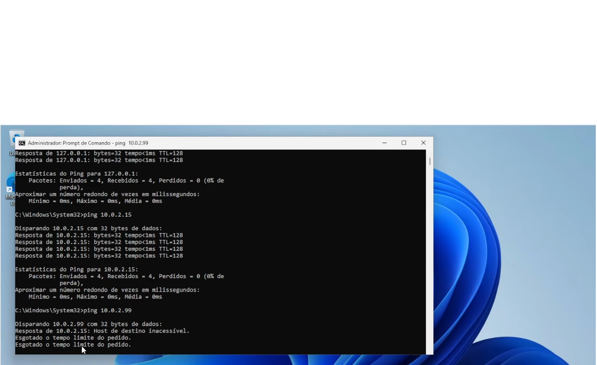

# Cenário 1: "Estou sem internet" (gateway incorreto)

| Item | Detalhe |
|---|---|
| Categoria | Rede |
| Prioridade | Alta: o usuário não consegue trabalhar |
| Ambiente | Windows 11 Enterprise em VirtualBox, rede NAT |
| Ferramentas | `ipconfig`, `ping`, `netsh` |
| Vídeo | [▶ Assistir](https://www.youtube.com/watch?v=82-pPgGI5r8) |

## Sintoma relatado
> "Meu computador está conectado, mas nenhum site abre."

## Como reproduzi
Em um CMD como administrador, configurei IP estático com um gateway inexistente
(no NAT do VirtualBox o gateway correto é `10.0.2.2`):
```cmd
netsh interface ip set address name="Ethernet" static 10.0.2.15 255.255.255.0 10.0.2.99
```
> Se o nome da interface for diferente, descubra com `netsh interface show interface`.

## Diagnóstico
Testei de dentro para fora, para localizar a camada com falha:

| Passo | Comando | Resultado esperado no cenário | Conclusão |
|---|---|---|---|
| 1 | `ipconfig /all` | IP 10.0.2.15, gateway 10.0.2.99 | Gateway suspeito |
| 2 | `ping 127.0.0.1` | Responde | Pilha TCP/IP local OK |
| 3 | `ping 10.0.2.15` | Responde | Placa de rede OK |
| 4 | `ping 10.0.2.99` | Falha (host inacessível/timeout) | **Gateway não responde** |
| 5 | `ping 8.8.8.8` | Falha | Sem saída para a internet |

## Causa raiz
Gateway padrão apontando para um endereço que não existe na rede.

## Solução aplicada
Voltei a configuração para automática (DHCP):
```cmd
netsh interface ip set address name="Ethernet" source=dhcp
ipconfig /renew
```

## Validação
```cmd
ipconfig /all        :: gateway 10.0.2.2
ping 8.8.8.8         :: responde
ping google.com      :: responde
```

## Prevenção
- Usar DHCP sempre que possível
- Documentar IPs fixos (planilha de endereçamento)
- Em IP fixo, conferir máscara e gateway antes de aplicar

## Prints
| Antes | Durante | Depois |
|---|---|---|
|  |  |  |

## Aprendizados
- Diagnosticar por camadas evita "chutar" soluções


[← Voltar ao índice do projeto](../README.md)
