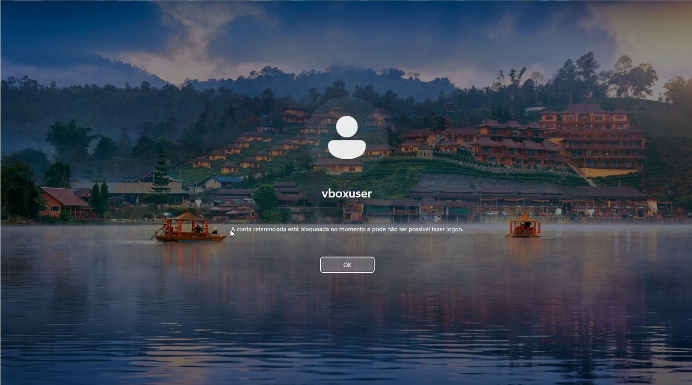
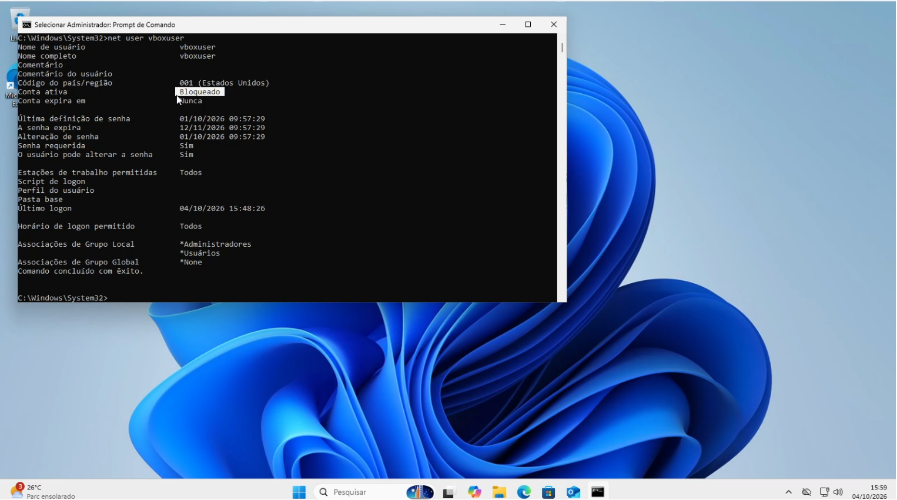

# Cenário 2: Conta de usuário bloqueada

| Item | Detalhe |
|---|---|
| Categoria | Contas e acesso |
| Prioridade | Média: usuário sem acesso ao computador |
| Ambiente | Windows 11 Enterprise (conta local `vboxuser` como teste) |
| Ferramentas | `net user`, `net accounts` |
| Vídeo | [▶ Assistir](LINK_DO_VIDEO) |

> O mesmo problema é refeito no Active Directory no [Projeto 2](../../02-active-directory/).

## Sintoma relatado
> "Errei a senha algumas vezes e agora não consigo mais entrar."

## Como reproduzi
1. Criei o usuário de teste (conta fictícia):
```cmd
net user teste Senha@123 /add
```
2. Defini bloqueio após 3 tentativas:
```cmd
net accounts /lockoutthreshold:3
```
3. Bloqueei a tela (Win+L) e errei a senha 3 vezes.

## Diagnóstico
```cmd
net user teste
```
Verifiquei o estado da conta e o histórico de falhas de logon no Visualizador de Eventos (Segurança).

## Causa raiz
O número de tentativas de senha incorretas excedeu o limite da política de bloqueio.

## Solução aplicada
Como administrador:
```cmd
net user teste /active:yes
```
(Também é possível aguardar o fim do tempo de bloqueio, se configurado.)

## Validação
O usuário consegue entrar com a senha correta.

## Limpeza do laboratório
```cmd
net accounts /lockoutthreshold:0
```

## Prevenção
- Orientar o usuário sobre troca de senha e dispositivos com senha antiga salva
- Duração de bloqueio automática em vez de desbloqueio manual
- Identificar a origem do bloqueio (celular, sessão aberta em outro PC)

## Prints
| Tentativas | Conta bloqueada | Desbloqueada |
|---|---|---|
|  |  |  |

## Aprendizados
- Indetificar a causa raiz e tratar do problema de imediato.
- Problemas como esse são "rápidos" de resolver e não precisam ficar muito tempo na fila de chamados.

[← Voltar ao índice do projeto](../README.md)
