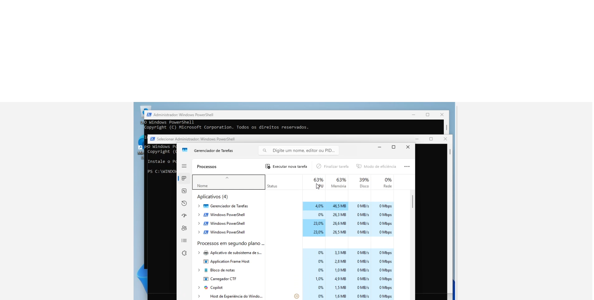
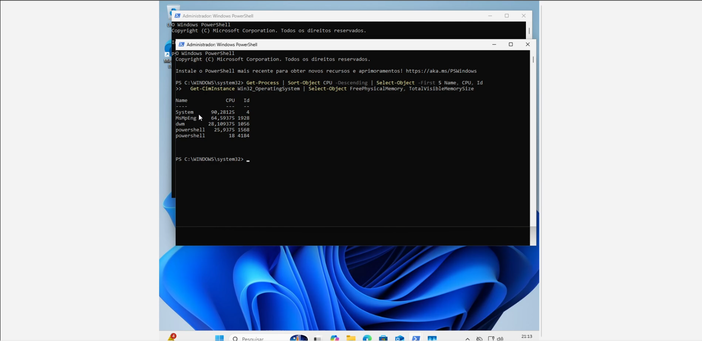
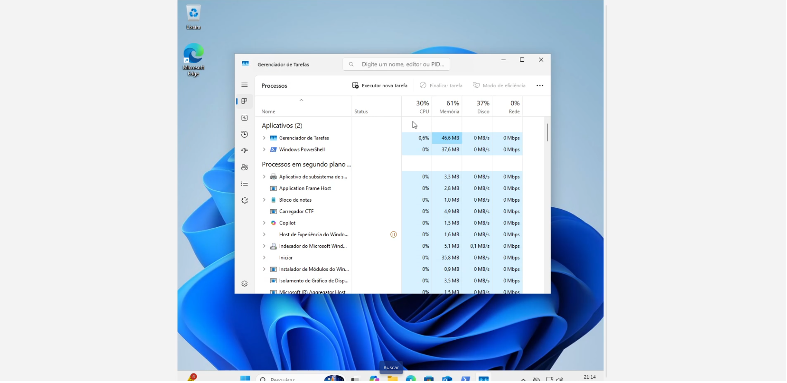

# Cenário 3: "O computador está muito lento"

| Item | Detalhe |
|---|---|
| Categoria | Desempenho |
| Prioridade | Média |
| Ambiente | Windows 11 Enterprise em VirtualBox |
| Ferramentas | Gerenciador de Tarefas, `Get-Process`, PowerShell |
| Vídeo | [▶ Assistir](LINK_DO_VIDEO) |

## Sintoma relatado
> "O computador travando, demora para abrir qualquer programa."

## Como reproduzi
Abri 3 janelas do PowerShell e, em cada uma, executei um laço que consome CPU:
```powershell
while ($true) {}
```

## Diagnóstico
1. **Gerenciador de Tarefas** (Ctrl+Shift+Esc) > aba Desempenho: CPU, memória, disco.
2. Identificar os maiores consumidores:
```powershell
Get-Process | Sort-Object CPU -Descending | Select-Object -First 5 Name, CPU, Id
```
3. Verificar memória livre:
```powershell
Get-CimInstance Win32_OperatingSystem | Select-Object FreePhysicalMemory, TotalVisibleMemorySize
```
4. Checar espaço em disco (`Get-PSDrive C`) e programas na aba **Inicializar**.

| Indicador | O que observei | Conclusão |
|---|---|---|
| CPU | ~100% | Processo consumindo CPU |
| Processos | `powershell` no topo | Origem identificada |

## Causa raiz
Processos consumindo CPU de forma contínua (no lab, simulados; no mundo real: malware, programas de inicialização, atualização travada).

## Solução aplicada
```powershell
Stop-Process -Id <ID do processo>
```
Finalizei manualmente os processos identificados consumindo CPU.

Desativei programas desnecessários na aba **Inicializar**.

## Validação
CPU volta ao normal e o sistema responde.

## Checklist de "PC lento"
- [ ] CPU, memória e disco no Gerenciador de Tarefas
- [ ] Espaço livre no disco
- [ ] Programas na inicialização
- [ ] Atualizações pendentes ou travadas
- [ ] Antivírus/varredura em andamento
- [ ] Reiniciou o computador recentemente?

## Prevenção
- Reinício periódico, manutenção preventiva
- Limitar programas na inicialização
- Monitoramento de recursos

## Prints
| Antes | Processos | Depois |
|---|---|---|
|  |  |  |

## Aprendizados
- Verificar as configurações do computador(RAM, processador, placa de vídeo, etc.), poís isso pode interferir também no desempenho.
- Não deixar muitos programas abertos sem uso.
- Orientação de colaboradores sobre boas práticas ao usar a máquina.

[← Voltar ao índice do projeto](../README.md)
