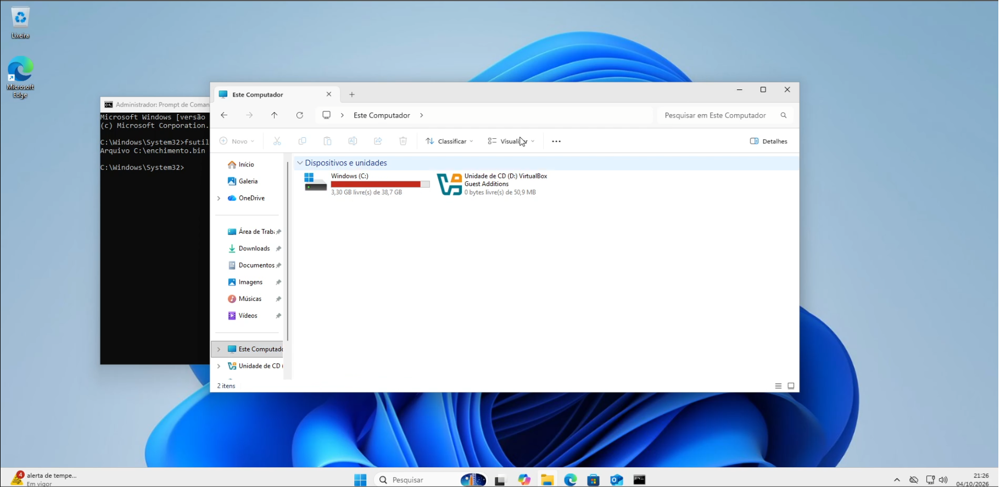
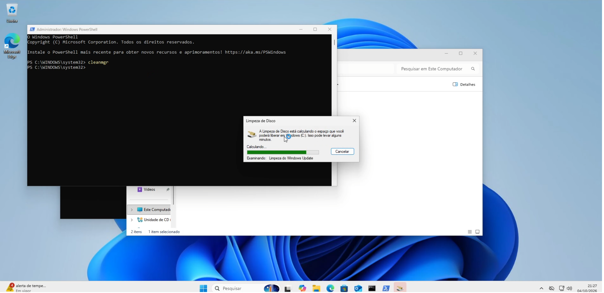
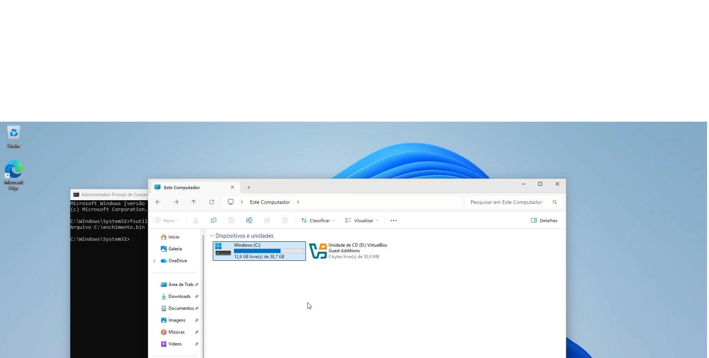

# Cenário 4: "Disco cheio / sem espaço"

| Item | Detalhe |
|---|---|
| Categoria | Armazenamento |
| Prioridade | Média/Alta: pode impedir atualizações e uso do sistema |
| Ambiente | Windows 11 Enterprise (disco de 40 GB) |
| Ferramentas | `Get-PSDrive`, `cleanmgr`, PowerShell |
| Vídeo | [▶ Assistir](LINK_DO_VIDEO) |

## Sintoma relatado
> "Aparece que o disco está quase cheio e o computador está lento."

## Como reproduzi
Criei um arquivo grande para consumir espaço (ajuste o tamanho ao seu disco):
```cmd
fsutil file createnew C:\enchimento.bin 10000000000
```

## Diagnóstico
1. Ver o espaço livre:
```powershell
Get-PSDrive C
```
2. Encontrar as pastas maiores:
```powershell
Get-ChildItem C:\ -Directory | ForEach-Object {
  "{0,-30} {1,10:N1} GB" -f $_.Name, ((Get-ChildItem $_.FullName -Recurse -File -ErrorAction SilentlyContinue | Measure-Object Length -Sum).Sum/1GB)
}
```
3. Alternativa visual: Configurações > Sistema > Armazenamento > Arquivos Grandes.

## Causa raiz
Arquivo grande desnecessário ocupando o disco (no mundo real: temporários, downloads, lixeira, backups antigos).

## Solução aplicada
```cmd
del C:\enchimento.bin
cleanmgr
```
Esvaziei a lixeira e limpei os temporários (`%TEMP%`).

## Validação
```powershell
Get-PSDrive C    # espaço livre aumentou
```

## Prevenção
- Script de limpeza periódica ([Projeto 3](../../03-scripts-automacao/))
- Alerta de espaço em disco
- Política de armazenamento na rede em vez de local

## Prints
| Disco cheio | Maiores pastas | Depois da limpeza |
|---|---|---|
|  |  |  |

## Aprendizados
- Evitar deixar arquivos descessários no computador, principalmente na pasta Downloads.
- Executar semanalmente uma limpeza "rápida" de arquivos.

[← Voltar ao índice do projeto](../README.md)
