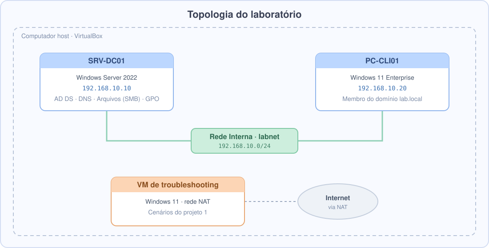
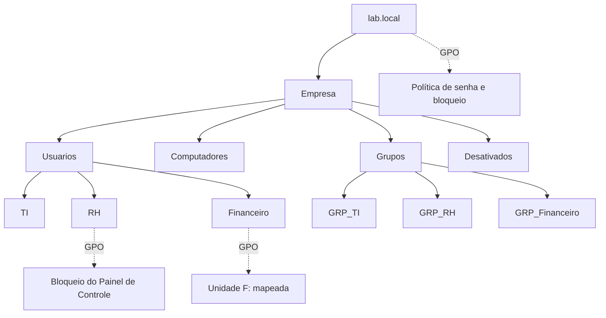

# Projeto 2: Active Directory e Políticas de Grupo (GPO)

## Objetivo
Construir um domínio Windows (`lab.local`) com estrutura de OUs, grupos, usuários e GPOs, e
resolver chamados típicos de suporte: reset de senha, desbloqueio de conta e liberação de acesso.

## Topologia

| Máquina | Sistema | IP | Função |
|---|---|---|---|
| SRV-DC01 | Windows Server 2022 | 192.168.10.10 | AD DS, DNS, servidor de arquivos |
| PC-CLI01 | Windows 11 Enterprise | 192.168.10.20 | Estação de trabalho |

Rede: Rede Interna `labnet` (VirtualBox), IPs estáticos, DNS do cliente apontando para o DC.

## Estrutura do Active Directory

## O que foi implementado
- [x] Promoção do controlador de domínio com PowerShell
- [x] OUs por departamento e grupos de segurança
- [x] Ingresso de estação de trabalho no domínio
- [x] GPO: bloqueio do Painel de Controle (RH)
- [x] GPO: mapeamento automático de unidade de rede (Financeiro)
- [x] GPO: política de senha e bloqueio de conta (domínio)
- [x] Compartilhamento de arquivos com permissões por grupo (SMB + NTFS)

## Chamados simulados

| Chamado | Ação | Comando |
|---|---|---|
| Esqueci minha senha | Redefinir senha | `Set-ADAccountPassword` |
| Conta bloqueada | Localizar e desbloquear | `Search-ADAccount -LockedOut` / `Unlock-ADAccount` |
| Preciso de acesso à pasta | Incluir em grupo | `Add-ADGroupMember` |
| Funcionário desligado | Desativar e mover | `Disable-ADAccount` / `Move-ADObject` |

## Documentação detalhada
Todo o passo a passo, com comandos e validações: **[passo-a-passo.md](passo-a-passo.md)**

## Problemas encontrados e soluções

| Problema | Causa | Solução |
|---|---|---|
| Cliente não encontra o domínio | DNS do cliente não aponta para o DC | Configurar DNS = 192.168.10.10 |
| Falha ao ingressar no domínio | Windows Home ou hora diferente | Usar Pro/Enterprise e sincronizar horário |
| GPO não aplica | OU errada, vínculo ou falta de atualização | `gpupdate /force` e `gpresult /r` |
| Troca de senha recusada | Senha fora da política de complexidade | Seguir a política definida |

## Vídeo
[▶ Assistir demonstração](LINK_DO_VIDEO)

## Aprendizados
- (escreva 3 a 5 pontos com suas palavras)

[← Portfólio principal](../README.md)
