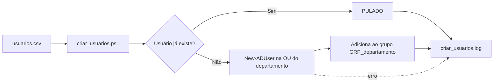
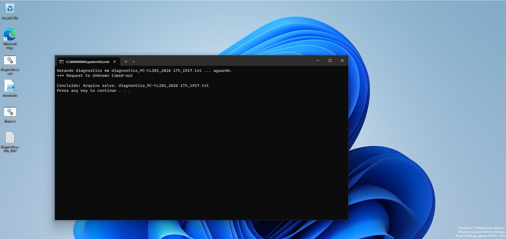
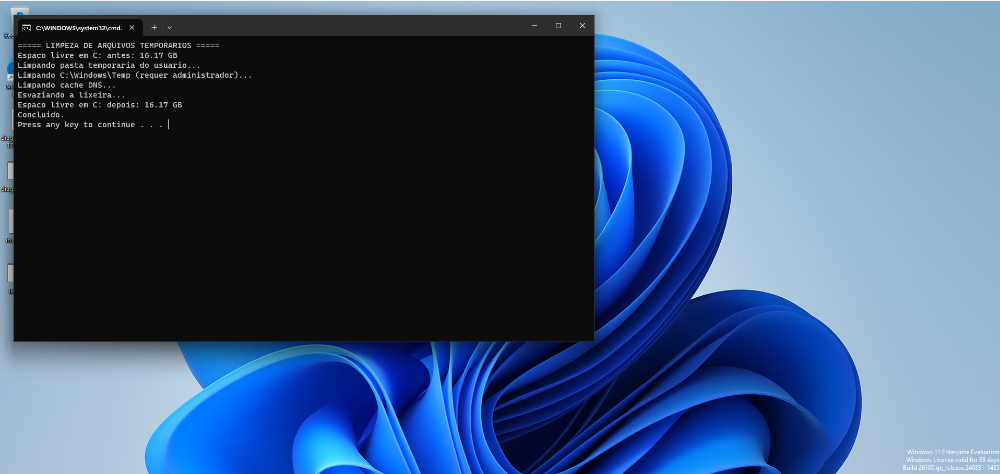
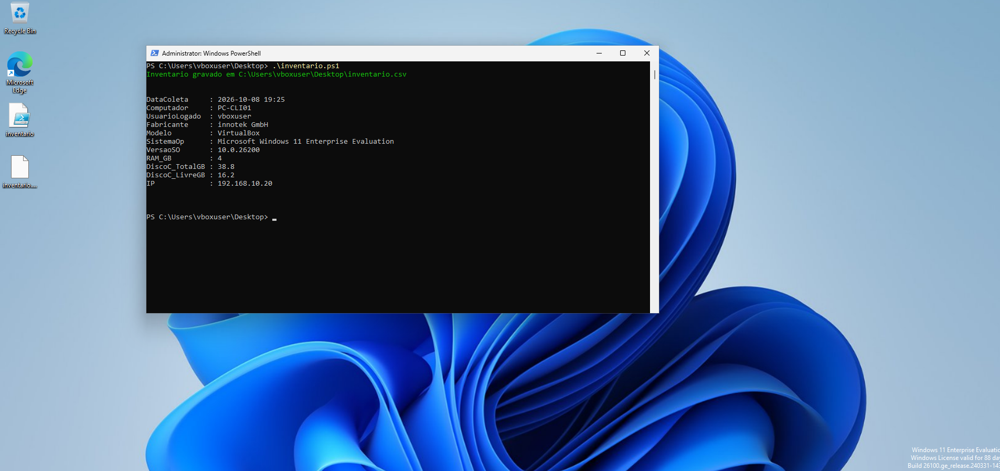

# Projeto 3: Scripts de automação para help desk

## Objetivo
Automatizar tarefas repetitivas de suporte: coleta de diagnóstico, limpeza, inventário,


## Estrutura
```
03-scripts-automacao/
├── windows/
│   ├── diagnostico_rede.bat
│   ├── limpeza.bat
│   ├── inventario.ps1
│   ├── criar_usuarios.ps1
│   └── usuarios.csv
└── prints/
```

## Fluxo da criação de usuários em lote


## Scripts

| Script | Linguagem | O que faz | Onde roda |
|---|---|---|---|
| [diagnostico_rede.bat](windows/diagnostico_rede.bat) | Batch | Coleta ipconfig, pings, nslookup, tracert e ARP e salva em `.txt` | Windows |
| [limpeza.bat](windows/limpeza.bat) | Batch + PowerShell | Limpa temporários, cache DNS e lixeira; mostra espaço liberado | Windows (administrador) |
| [inventario.ps1](windows/inventario.ps1) | PowerShell | Coleta hardware/SO/IP e exporta para CSV | Windows |
| [criar_usuarios.ps1](windows/criar_usuarios.ps1) | PowerShell | Cria usuários no AD a partir de CSV, com log e tratamento de erro | Windows Server (AD) |

## Como usar

### 1. diagnostico_rede.bat
1. Dê dois cliques (ou execute no CMD).
2. Será gerado `diagnostico_<PC>_<data>_<hora>.txt` na mesma pasta.
3. Anexe o arquivo ao chamado.

> A data do nome do arquivo assume formato brasileiro (dd/mm/aaaa).

### 2. limpeza.bat
Clique com o botão direito > **Executar como administrador**. O script mostra o espaço livre antes e depois.

### 3. inventario.ps1
```powershell
Set-ExecutionPolicy -Scope Process -ExecutionPolicy Bypass
.\inventario.ps1
```
Gera/atualiza `inventario.csv` (separador `;`, abre direto no Excel).

### 4. criar_usuarios.ps1
Pré-requisito: OUs e grupos criados no [Projeto 2](../02-active-directory/).
```powershell
Set-ExecutionPolicy -Scope Process -ExecutionPolicy Bypass
.\criar_usuarios.ps1
```
Lê `usuarios.csv`, cria os usuários, adiciona aos grupos `GRP_<Departamento>` e registra tudo em `criar_usuarios.log`.


## Decisões de projeto
- **Idempotência:** rodar o script de usuários duas vezes não duplica contas
- **Log** de todas as ações
- **Tratamento de erros** (`try/catch` no PowerShell, código de saída no Bash)
- **Dados fictícios** em todos os exemplos

## Testes realizados

| Teste | Resultado esperado |
|---|---|
| Diagnóstico com DNS correto e com DNS quebrado | Falha de nslookup registrada no segundo |
| Limpeza com arquivos temporários criados | Espaço liberado informado |
| Inventário em 2 máquinas | 2 linhas no CSV |
| Criar usuários 1ª execução | 5 usuários criados |
| Criar usuários 2ª execução | Todos "PULADO" |
| Departamento inexistente no CSV | Erro registrado no log, sem travar |

## Prints
| 1 | 2 | 3 |
|---|---|---|
|  |  |  |

## Aprendizados
- Comandos automatizados que ajudam tarefas do dia-a-dia.
- Programação pouco complexa.

[← Portfólio principal](../README.md)
