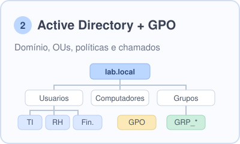
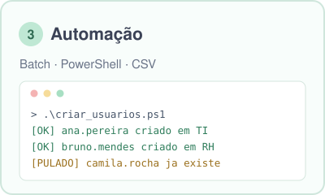

##  Olá 👋

Este repositório reúne laboratórios práticos que simulam problemas reais do dia a dia. Cada um segue o mesmo caminho:
**problema → diagnóstico → solução → documentação**, alguns com um vídeo curto mostrando o funcionamento.

<p align="center">
  
  
  
  <!--  -->
  
  
</p>
---

## 🗂️ Projetos

<table>
  <tr>
    <td width="33%"><a href="01-cenarios-troubleshooting/"></a></td>
    <td width="33%"><a href="02-active-directory/"></a></td>
    <td width="33%"><a href="03-scripts-automacao/"></a></td>
  </tr>
  <tr valign="top">
    <td>Reprodução e diagnóstico de <b>4 incidentes</b> comuns: sem internet, DNS, conta bloqueada, PC lento e disco cheio.</td>
    <td>Domínio <code>lab.local</code> do zero: OUs, grupos, usuários, <b>GPOs</b>, pasta compartilhada com permissões por grupo e rotinas de suporte.</td>
    <td>Scripts para <b>diagnóstico de rede, limpeza, inventário</b>, criação de usuários em lote no AD, backup e alerta de disco no Linux.</td>
  </tr>
  <tr>
    <td align="center"><a href="01-cenarios-troubleshooting/">📖 Documentação</a> · <a href="LINK_DO_VIDEO">▶ Vídeo</a></td>
    <td align="center"><a href="02-active-directory/">📖 Documentação</a> · <a href="LINK_DO_VIDEO">▶ Vídeo</a></td>
    <td align="center"><a href="03-scripts-automacao/">📖 Documentação</a> · <a href="LINK_DO_VIDEO">▶ Vídeo</a></td>
  </tr>
</table>

<!--
  PRÉVIAS EM GIF (opcional, deixa o portfólio muito mais vivo):
  1. Crie um GIF de 5 a 8 segundos de cada projeto (veja COMO-PUBLICAR.md)
  2. Salve em assets/previews/ e remova os comentários abaixo

<p align="center">
  
  
  
</p>
-->

---

## 🔎 Acesso rápido aos cenários de troubleshooting

Cada linha leva direto à documentação do cenário e ao vídeo, sem precisar navegar pelas pastas.

| # | Problema | Camada | Ferramentas | Documentação | Vídeo |
|:-:|---|---|---|:-:|:-:|
| 1 | Sem internet (gateway incorreto) | Rede | `ipconfig` `ping` `netsh` | [Abrir](01-cenarios-troubleshooting/01-sem-internet/) | [▶](LINK_DO_VIDEO) |
| 2 | Site não abre, ping por IP funciona (DNS) | Rede | `nslookup` `flushdns` | [Abrir](01-cenarios-troubleshooting/02-erro-dns/) | [▶](LINK_DO_VIDEO) |
| 3 | Conflito de endereço IP | Rede | `arp` `eventvwr` | [Abrir](01-cenarios-troubleshooting/03-conflito-ip/) | [▶](LINK_DO_VIDEO) |
| 4 | Conta de usuário bloqueada | Contas | `net user` | [Abrir](01-cenarios-troubleshooting/04-conta-bloqueada/) | [▶](LINK_DO_VIDEO) |
| 5 | Computador lento | Desempenho | `Get-Process` | [Abrir](01-cenarios-troubleshooting/05-computador-lento/) | [▶](LINK_DO_VIDEO) |
| 6 | Disco cheio | Armazenamento | `Get-PSDrive` `cleanmgr` | [Abrir](01-cenarios-troubleshooting/06-disco-cheio/) | [▶](LINK_DO_VIDEO) |
| 7 | Impressora não imprime (fila travada) | Impressão | `sc query` `spooler` | [Abrir](01-cenarios-troubleshooting/07-impressora-nao-imprime/) | [▶](LINK_DO_VIDEO) |
| 8 | Perfil de usuário corrompido | Windows | `regedit` | [Abrir](01-cenarios-troubleshooting/08-perfil-corrompido/) | [▶](LINK_DO_VIDEO) |
| 9 | Impressora parou de imprimir (IP mudou: DHCP x IP fixo) | Rede / Impressão | `Test-NetConnection` `DHCP` | [Abrir](01-cenarios-troubleshooting/09-impressora-ip-dinamico/) | [▶](LINK_DO_VIDEO) |

---

## 🧭 Como eu diagnostico

<p align="center">
  
</p>

---

## 🏗️ Ambiente do laboratório

<p align="center">
  
</p>

---

## 🧰 Tecnologias e o que pratiquei

| Área | O que fiz | Ferramentas |
|---|---|---|
| **Redes** | Diagnóstico por camadas, IP, gateway, DNS, ARP | `ipconfig` `ping` `tracert` `nslookup` `arp` |
| **Windows Server** | Controlador de domínio, DNS, compartilhamentos | AD DS, DNS, SMB, NTFS |
| **Active Directory** | OUs, grupos, usuários, GPOs, reset e desbloqueio | `gpmc.msc` `Set-ADAccountPassword` `Unlock-ADAccount` |
| **Automação** | Diagnóstico, limpeza, inventário, usuários em lote | Batch, PowerShell, Bash, cron |
| **Linux** | Backup agendado e monitoramento de disco | Ubuntu Server, `tar`, `df`, `cron` |
| **Virtualização** | Laboratório com snapshots e redes isoladas | VirtualBox |

### 💡 Diferencial
Venho de sistemas corporativos: já trabalhei com **parametrização, regras de negócio, SQL, PostgreSQL, APIs REST e Laravel**.
Isso me ajuda a entender o problema do usuário e a conversar com times técnicos e de negócio, além de automatizar o que é repetitivo.

---

<details>
<summary><b>📁 Estrutura do repositório</b></summary>

```
portfolio-ti-infra-suporte/
├── README.md                          ← você está aqui
├── assets/                            ← ilustrações do portfólio
├── 01-cenarios-troubleshooting/
│   ├── README.md                      ← índice + metodologia
│   ├── CHEATSHEET.md                  ← cola de comandos
│   ├── 01-sem-internet/   ... 09-impressora-ip-dinamico/
├── 02-active-directory/
│   ├── README.md
│   └── passo-a-passo.md
└── 03-scripts-automacao/
    ├── README.md
    ├── windows/   (.bat, .ps1, .csv)
    └── linux/     (.sh)
```
</details>

> Todos os usuários, senhas, domínios e IPs usados nos laboratórios são **fictícios**.

---

## 📫 Contato

<p align="center">
  <a href="https://linkedin.com/in/brunobarrosof"></a>
  <a href="mailto:bruno.barrosof@outlook.com"></a>
</p>
